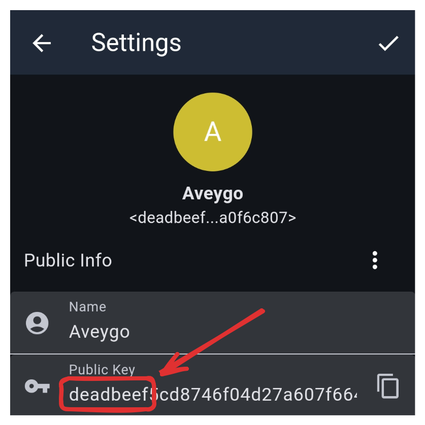

<p align="center">
  
</p>

# Meshcore Vanity

This program mines (hex) vanity addresses for meshcore.

## Features

 - Calculates vanity addresses on the CPU

## Caveats

Because this program calculates vanity addresses on the CPU and not the GPU, it's quite slow. For something like 'deadbeef' it can take several hours on 16 threads. For every character you add on, this number is multiplied 16-fold, so chose wisely and be patient.

A secret tip is that you can run this program on as many computers as you want in order to minimize time ;)

## Usage

See releases to download the binary (linux only!):

```bash
$ ./meshcore_vanity B00B1E5 16
Started looking for 'B00B1E5' using 16 threads...
Found vanity public key after 16566534 attempts!
Identity: fbe10d...b00b1e5
```

> [!IMPORTANT]
> This program will by default calculate vanity **suffixes**. This is because Meshcore uses the first byte of each public key (two hexadecimals) for calculating paths between nodes, which should ideally be unique. 
> If you want a custom vanity **prefix**, please make sure that your vanity address does not use the first two hex characters of any neighboring nodes! Once you have confirmed this, you can use the "--i-know-what-im-doing" flag to calculate your vanity **prefix** address. 
> *Please keep the mesh functional and be a good neighbor!*

Once you calculate your identity key, you'll need to send it to your companion app in a secure manner (or you can use email if you're lazy like me).

## Building

```
make
```

## Some ideas

Here are some neat things you could mine for (times are approximate and will strongly depend on your machine & number of threads):

```
2025      instant
CAFE
DECAF
C0FFEE    ~1 minute
57AB1E
BOOBOO
D00DLE
DECADE    
0DDBA11   ~15 minutes
CA5CADE
DEC1BE1
DEC0DED   
CA11AB1E  ~4 hours
DEADBEEF  
BAAAAAAD
D15EA5ED
420FADED
FACEFEED
CAFEBABE  
```

I would avoid anything longer than 8 characters unless you want to show off your compute. At 19 characters, it'll be easier to mine a bitcoin block from scratch, which is ```D1AB011CA1```.

I've also included a little python script that [I found](https://gist.github.com/xieve/179d452b05fb0860128ec4a4f06ca680) in the source code that might be useful to test out some ideas before spending hours mining an address.

## Warning!

When I was looking through the meshcore code, there's a [special condition](https://github.com/meshcore-dev/MeshCore/blob/0767fc49e508dc6ead657a0cd2d0eba1f4ae46da/examples/companion_radio/MyMesh.cpp#L665) that "prevents" (makes it very unlikely) for an address to start with ```00``` or ```FF```. I have absolutely no idea why the devs coded it like that, all I know is that it's a "reserved id hash" so take with that what you will.

## Why C?

Meshcore uses Nightcracker's portable implementation of ed25519 to calculate signatures / encryption. For some reason, this implementation produces different results to standard python libraries such as libsodium or nacl, which is why we're forced to use C to calculate these vanity addresses.

## Security

> [!CAUTION]
> **Never** use identity keys from third parties! If you didn't calculate the private key yourself, then it doesn't belong to you!

I haven't really dug too deep in the weeds, but the keys generated from this script *should be* cryptographically secure, given that entropy is sourced from /dev/urandom and the utilized ed25519 library should be safe to use (it's the same one used in the official meshcore firmware). 

That being said, if you want maximum security then you really shouldn't take the risk with my script, and I recommend sticking to the default usage of meshcore.